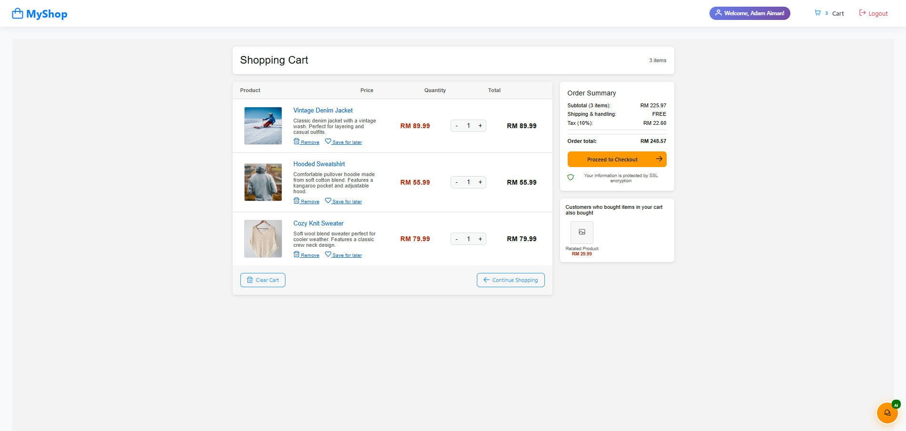
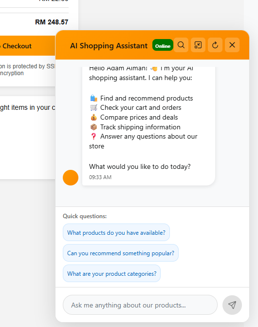
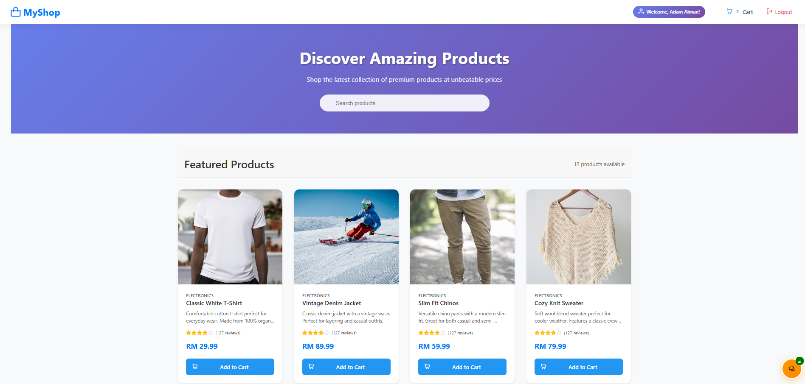

# ECommerce - Full Stack Amazon-Inspired Shop App

A full-featured e-commerce web application built with React, Express, MongoDB, and Gemini AI. This project demonstrates a professional, responsive online shop with cart, checkout, authentication, and an AI-powered chatbot assistant.

---

## 🚀 Features

- Amazon-inspired UI/UX with mobile and tablet responsiveness
- Product catalog, search, and filtering
- Shopping cart with quantity controls and order summary
- Multi-step checkout with payment simulation
- JWT-based authentication (register/login/logout)
- AI chatbot assistant (Gemini API) for product help, cart guidance, and general queries
- Environment variable support for secure config

---

## 🛠️ Tech Stack

- **Frontend:** React, PrimeReact, CSS (custom, grid/flexbox)
- **Backend:** Node.js, Express
- **Database:** MongoDB (local/Atlas)
- **AI:** Gemini API (Google Generative Language)
- **Authentication:** JWT

---

## 📦 Folder Structure

```
ECommerce/
├── client/
│   ├── src/
│   │   ├── components/         # React components (ProductCard, Header, Footer, ChatbotEnhanced)
│   │   ├── context/            # Context providers (cart, user, chatbot)
│   │   ├── pages/              # Main pages (cartPage, paymentPage, LoginPage, RegisterPage)
│   │   ├── styles/             # CSS files (App.css, cartPage.css, ChatbotEnhanced.css)
│   │   ├── App.js              # Main app component
│   │   ├── index.js            # React entry point
│   ├── public/                 # Static assets
│   ├── package.json            # Frontend dependencies
├── server/
│   ├── models/                 # Mongoose models (Product, Cart, User)
│   ├── routes/                 # Express routes (productRoutes, cartRoutes, authRoutes, chatbotRoutes)
│   ├── middleware/             # Auth middleware
│   ├── config/                 # DB config
│   ├── index.js                # Express server entry
│   ├── .env                    # Environment variables
│   ├── .env.example            # Example env file
│   ├── package.json            # Backend dependencies
├── README.md                   # Project documentation
├── LICENSE                     # License file
```

---

## ⚙️ Setup & Installation

1. **Clone the repo:**
   ```sh
   git clone https://github.com/GobLyne/ECommerce.git
   ```
2. **Install dependencies:**
   ```sh
   cd server && npm install
   cd ../client && npm install
   ```
3. **Configure environment variables:**
   - Copy `.env.example` to `.env` in the `server/` folder and fill in your values (MongoDB URI, JWT secret, Gemini API key, etc.)
4. **Seed products (optional):**
   ```sh
   node server/seedClothingProducts.js
   ```
5. **Start the backend:**
   ```sh
   cd server && npm start
   ```
6. **Start the frontend:**
   ```sh
   cd client && npm start
   ```
7. **Access the app:**
   - Frontend: [http://localhost:3000](http://localhost:3000)
   - Backend API: [http://localhost:5000/api](http://localhost:5000/api)

---

## 🔑 Environment Variables

See `server/.env.example` for all required variables:

- `MONGO_URI` - MongoDB connection string
- `JWT_SECRET` - JWT signing key
- `PORT` - Backend server port
- `NODE_ENV` - Environment (development/production)
- `CLIENT_URL` - Frontend URL for CORS
- `GEMINI_API_KEY` - Gemini AI API key

---

## 🧑‍💻 Usage Guide

- Register or login to start shopping
- Add products to your cart, adjust quantities
- Proceed to checkout and simulate payment
- Use the AI chatbot for help with products, cart, or general questions

---

## 📚 API Endpoints

### Products

- `GET /api/products` - List all products
- `POST /api/products` - Add new product

### Cart

- `GET /api/cart` - Get user cart
- `POST /api/cart/add` - Add item to cart
- `POST /api/cart/remove` - Remove item from cart
- `DELETE /api/cart/clear` - Clear cart

### Auth

- `POST /api/auth/register` - Register user
- `POST /api/auth/login` - Login user

### Chatbot

- `POST /api/chatbot/chat` - Send message to AI assistant
- `GET /api/chatbot/suggestions` - Get quick questions
- `POST /api/chatbot/search-products` - Search products

---

## 🖼️ Screenshots





---

## 📄 License

This project is licensed under the MIT License.

---

## 📎 Links

- [GitHub repo](https://github.com/GobLyne/ECommerce)
- [API docs](#api-endpoints)
- [Setup guide](#setup--installation)
